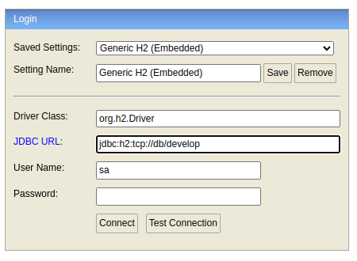
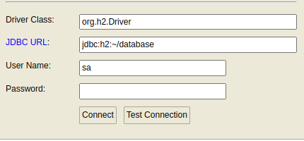

# Gerenciador e catalogo de mídias

O usuario do aplicativo, chamado de espectador, poderá associar diferentes mídias ao seu catálogo pessoal de mídias, como livros e filmes.

## Features

- CRUD de Espectadores e Mídias (Livros e Filmes);
- Validação das entidades de dominio;
- MockData para desenvolvimento carregando automaticamente através de um loader; 
- Busca de endereço através do CEP

# Docker

Se você tiver Docker instalado, execute o comando em seguida para iniciar as duas camadas simultaneamente (frontend e backend):
```
docker-compose up --build
```

- [frontend](http://localhost:3000)
- [backend](http://localhost:3001/swagger-ui/index.html)
- [H2 Console](http://localhost:8082/)



# Frontend

O projeto frontend consiste em uma aplicação WEB baseada em REACT.

```
### Em Desenvolvimento ##
```

# Backend

## Requerimentos

 - [Java SDK 17](https://www.oracle.com/java/technologies/javase/jdk17-archive-downloads.html)
 - Mavem
 - Springboot 3.3.4

O projeto backend consiste em uma aplicação API springboot (JAVA). Ela é totalmente desacoplada do frontend

Para iniciar o projeto rode:
```
cd backend && mvn spring-boot:run
```

## Swagger local

Clique no link abaixo para acessar a documentação da API
    
[LINK](http://localhost:3001/swagger-ui/index.html) 


## Database local

Clique no link abaixo para acessar o database local de desenvolvimento.
    
[LINK](http://localhost:3001/h2-console) 



